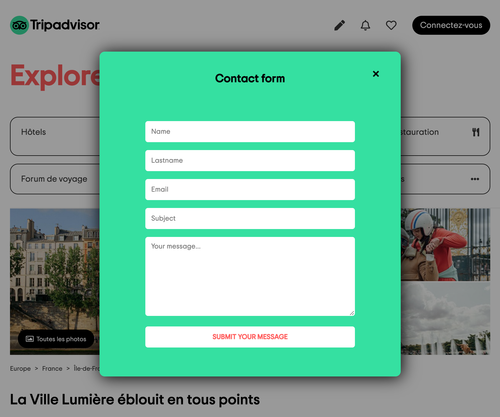

# TRIPADVISOR CLONE 🏖

⛅️ April 2021  
⚙️ Backend - check the backend [repo](https://github.com/manon-boiteau/tripAdvisor-back-LeReacteur/blob/main/index.js) (modal contact form)  
✨ Frontend  
🔗 Netlify - check [that](https://mytripadvisor-lereacteur-2021.netlify.app/)

## 🌈 Overview - Welcome dude

---

TripAdvisor clone made at [Le Reacteur](https://www.lereacteur.io/) Bootcamp.  
4 screens are availables: TripAdvisor home page for desktop, tablette, mobile and modal contact form.

## 👩🏻‍💻 Tasks

---

✘ Do integration (CSS only: flexbox, calc, carousel)  
✘ Create a modal
✘ Make responsive - the most important par of the project

## 📚 Stacks

---

[HTML5](https://www.w3schools.com/html/default.asp)  
[CSS3](https://www.w3schools.com/css/default.asp)

## 🗝 Installation and usage

---

No particular installation, the project is made with only HTML5 and CSS3.

🙏🏻 Thank you @LeReacteur.
